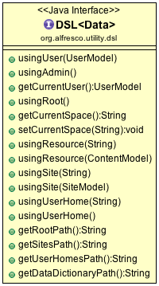
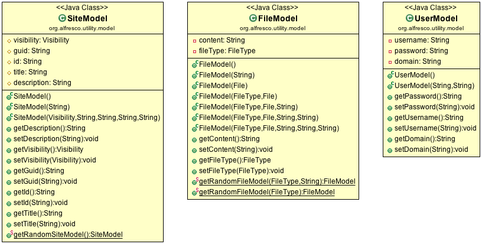
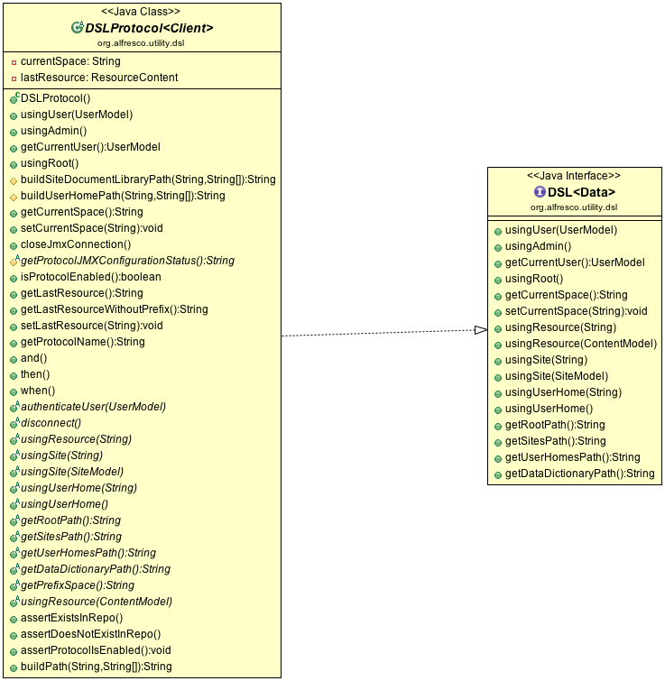
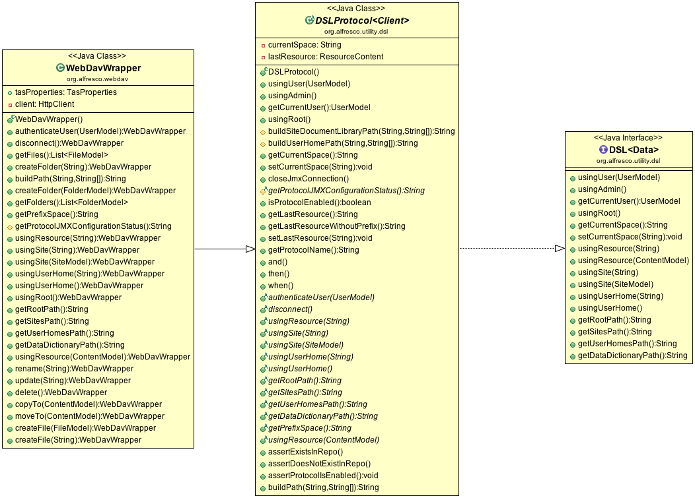
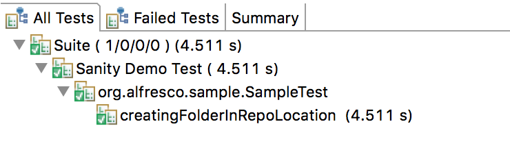
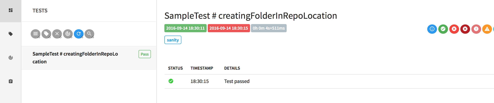
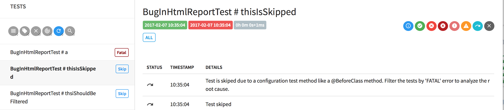
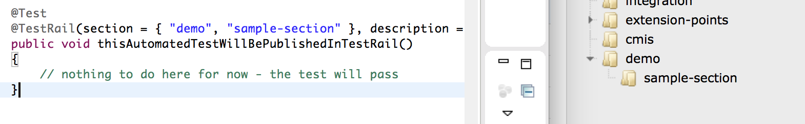
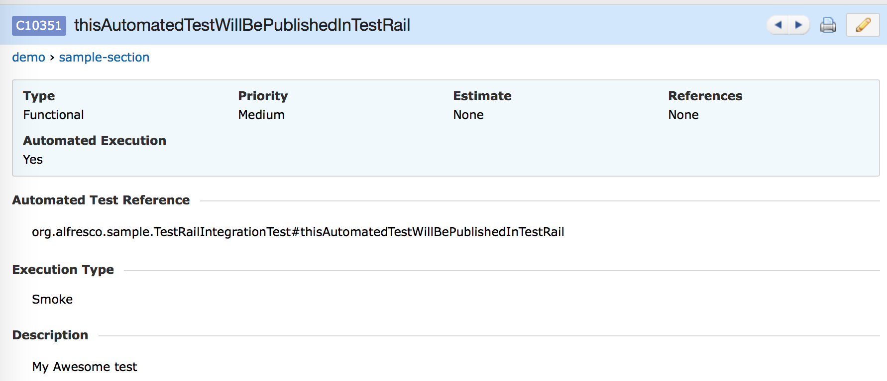

:paw_prints:  Back to [TAS Master Documentation](https://gitlab.alfresco.com/tas/documentation/wikis/home)

---
 
## Table of Contents
* [Synopsis](#synopsis)
* [Prerequisite](#prerequisite)
* [Installation](#installation-if-you-want-to-contribute-or-run-tests-from-your-local-machine)
* [Package Presentation](#package-presentation)
* [High Level Concepts](#high-level-con with this report, yocepts)
    * [DSL](#dsl)
    * [Models](#models)
    * [Protocol(s)](#protocol-s)
* [Sample Usage](#sample-usage)
* [Configure your maven project to use tas.utility](#configure-your-maven-project-to-use-tas-utility)
* [Naming Conventions](#naming-conventions)
* [How to write a test](#how-to-write-a-test)
* [How to create new data (files/folder)?](#how-to-create-new-data-files-folder)
* [How to create a new site?](#how-to-create-a-new-site)
* [How to run tests?](#how-to-run-tests)
    * [using-testng-suite](#using-testng-suite)
    * [from command line](#from-command-line)
* [Test Results](#test-results)
* [Test Rail Integration](#test-rail-integration)
    * [Configuration](#configuration)  
    * [How to enable Test Rail Integration?](#how-to-enable-test-rail-integration)
* [Reference](#reference)
* [Change Log](docs/CHANGELOG.md) :glowing_star: 
* [Contributors](#contributors)
* [License](#license)

## Synopsis

This is the home of the **TAS**( **T**est **A**utomation **S**ystem)- **Utility** project.
It is based on Apache Maven, compatible with major IDEs and is using also Spring capabilities for dependency injection.

As a high level overview, this project contains a couple of functionalities useful for automation testing as: 
* reading/defining test environment settings (e.g. alfresco server details, authentication, etc.)
* utilities (creating files,folders)
* test data generators (for site, users, content, etc)
* helpers (i.e. randomizers, test environment information)
* test reporting capabilities
* test management integration (at this point we support integration with [Test Rail](https://alfresco.testrail.net) (v5.2.1)
* Health checks (verify if server is reachable, if server is online)
* Generic Internal-DSL (Domain Specific Language)

(take a look also on [this](https://gitlab.alfresco.com/tas/alfresco-tas-tester/wikis/Features) page: we will try to keep it up to date with the latest features based on each release)

Using a centralized location (Nexus), everyone will be able to reuse this individual interfaces in their own projects, adding new functionalities, extending also the automation core functionalities - that will be shared across teams. 

**[Back to Top ^](#table-of-contents)**

## Prerequisite 
(tested on unix/non-unix destribution)
* [Java SE 1.8](http://www.oracle.com/technetwork/java/javase/downloads/index.html).
* [Maven 3.3](https://maven.apache.org/download.cgi) installed and configure according to [Windows OS](https://maven.apache.org/guides/getting-started/windows-prerequisites.html) or [Mac OS](https://maven.apache.org/install.html).
* Configure Maven to use Alfresco alfresco-internal repository following this [Guide](https://ts.alfresco.com/share/page/site/eng/wiki-page?title=Maven_Setup).
* Your favorite IDE as [Eclipse](https://eclipse.org/downloads/) or [InteliJ](https://www.jetbrains.com/idea).
* Access to [Nexus](https://nexus.alfresco.com/nexus/) repository.
* Access to Gitlab [TAS](https://gitlab.alfresco.com/tas/) repository.
* GitLab client for your operating system. (we recommend [SourceTree](https://www.sourcetreeapp.com) - use your google account for initial setup).
* Getting familiar with [Basic Git Commands](http://docs.gitlab.com/ee/gitlab-basics/basic-git-commands.html).
* Getting familiar with [Maven](https://maven.apache.org/guides/getting-started/maven-in-five-minutes.html).
* Getting familiar with [Spring](http://docs.spring.io).

**[Back to Top ^](#table-of-contents)**

## Installation (if you want to contribute or run tests from your local machine)

* Open your Gitlab client and clone the repository of this project.
* You can do this also from command line (or in your terminal) adding:

```bash
# this command will cloen the utility project locally
$ git clone https://gitlab.alfresco.com/tas/alfresco-tas-tester.git 

# this clone will have the latest changes from repository. If you want to checkout a specific version released, take a look at the [Change Log](docs/CHANGELOG.md) page
$ cd alfresco-tas-tester
# this command will checkout the remove v1.0.0 tagged repository and create locally a new branch v1.0.0
$ git checkout tags/v1.0.0 -b v1.0.0 
```

* Install and check if all dependencies are downloaded
(in your downloaded repository run the following commands:)

```bash
$ mvn clean install -DskipTests
# you should see one [INFO] BUILD SUCCESS message displayed
```
**[Back to Top ^](#table-of-contents)**

## Package Presentation

This project uses a simple maven project [archetype](https://maven.apache.org/plugins-archives/maven-archetype-plugin-1.0-alpha-7/examples/simple.html):
```ruby
├── src
│   ├── main
│   │   ├── java
│   │   │   └── org
│   │   │       └── alfresco
│   │   │           └── utility
│   │   │               ├── data # helpers for creating Sites/Files, Users, etc)
│   │   │               │   (...)
│   │   │               ├── dsl  #contains all the interfaces, abstract classes that will be available for all protocols, apis
│   │   │               │   ├──(...)
│   │   │               ├── exception # custom exception
│   │   │               │   (...)
│   │   │               ├── extention # utilities that will handle testing of Extention Points
│   │   │               │   ├── ExtensionPointTestSuite.java
│   │   │               │   ├── ExtentionPointTestUtility.java
│   │   │               ├── model #modeling generic objects that will be reused in test
│   │   │               │   ├── FileModel.java
│   │   │               │   ├── FileType.java
│   │   │               │   ├── FolderModel.java
│   │   │               │   └── UserModel.java
│   │   │               │   └── (...)
│   │   │               ├── network # network based helpers
│   │   │               │   └── (...)
│   │   │               ├── report #handling reporting (i.e. listeners for generating html reports, steps)
│   │   │               │   └── (...)
│   │   │               └── testrail # TestRail integration utils
│   │   │               │   └── (...)
│   │   └── resources
│   |     └── shared-resources  #here you can add any files/configuration files that you want to be avaiable in projects that will consume tas.utility
│   └── test
│       ├── java
│       │   └── org
│       │       └── alfresco
│       │           └── utility #testing classes/sample code
│       │               ├── (...)
│       └── resources
│           ├── default.properties #one place where you defined all settings like what alfresco server to use, credentials, etc.
│           ├── log4j.properties
│           ├── testdata #placeholder for holding test data
│           │   └── (...)
```

**[Back to Top ^](#table-of-contents)**

## High Level Concepts

### DSL
The tas.utility has built-in one internal Domain Specific Language ([DSL](https://en.wikipedia.org/wiki/Domain-specific_language)) for handling data creation, for oferring a common way of using protocols, api's.
This DSL is made available in src/main/java/org/alfresco/utility under "dsl" package.



As you see above there are available a couple of methods for:
* defining current test user or getting current user used in test:

  ```java
    .usingUser(UserModel testUser)
    .getCurrentUser()
  ```
* or even admin (as defined in default.properties):

  ```java
    .usingAdminUser()
  ```
  
* specifying current space (like root folder, data dictionary, or a particular site:

  ```java
    .usingRoot()
    .usingSite(String siteId)
    .usingSite(SiteModel testSite)
    (...)
  ```
* or specifying a particular resource (like file/folder):

  ```java
    .usingResource(String fileNameOrFolderName)
    .usingResource(ContentModel content)
    (...)
  ``` 
  The advantage of this approach is that you can combine this DSL in a logical order as the steps of a test like:

  ```java
    .usingAdminUser().usingSite("mySite").usingResource("myFile")
    (...)
  ``` 
  This will tell us, that we will use resource file "myFile", with admin user from ("/Sites/mySite/documentLibrary").
  This is a general overview of the DSL, so each protocol that will implement this DSL will have the same method signature.
  
### Models
I assume you already notice a couple of *Model variables, like UserModel or SiteModel, ContentModel, etc. This is another concept that we will use in the tas framework.
All methods of the DSL will accept this generic methods that are available in src/main/java/org/alfresco/utility under "models" package. 



Having this implementation, we can all use the same approach, the same models when we define and create new tests.

### Protocol(s)

If we are talking about protocols like (CIFS, WebDav, FTP, etc.) for them we have another DSL


Thiw will add the implementation of generic DSL, plus new utilities that will ease our life (like building paths to a particular location, assertions, JMX configuration, etc)

See bellow as example, the implementation of WebDavWrapper (we call it wrapper, because is a class around a standard library: in this case [jackrabbit.apache](https://jackrabbit.apache.org/jcr/index.html) for testing WebDav)


(This is a project that is consuming tas.utility found also on http://gitlab.alfresco.com)

**[Back to Top ^](#table-of-contents)**


## Sample Usage

In your maven project, in your pom.xml file add the following dependency
```
<dependency>
			<groupId>org.alfresco.tas</groupId>
			<artifactId>utility</artifactId>
			<version>${tas.utility.version}</version>
</dependency>
```
(where ${tas.utility.version} is the latest verion released on [Nexus](https://artifacts.alfresco.com/nexus/content/groups/internal) internal)
You can also take a look on our [changelog](docs/CHANGELOG.md) page for more details.

**_NOTE_:** _you can also browse the [samples](samples) folder for simple maven projects that is consuming this library. Just import this existing Maven project in your IDE (if you are using Eclipse follow [this](http://help.eclipse.org/kepler/index.jsp?topic=%2Forg.eclipse.platform.doc.user%2Ftasks%2Ftasks-importproject.htm) guide)_

### Configure your maven project to use tas.utility

**_NOTE_:** _you can also browse the [samples](samples) folder for simple maven projects that is consuming this library. Just import this existing Maven project in your IDE (if you are using Eclipse follow [this](http://help.eclipse.org/kepler/index.jsp?topic=%2Forg.eclipse.platform.doc.user%2Ftasks%2Ftasks-importproject.htm) guide)_

* if you have one [simple maven project](https://maven.apache.org/plugins-archives/maven-archetype-plugin-1.0-alpha-7/examples/simple.html) created, you must add Spring bean capabilities to interact with tas.utility project
	* add dependency to your pom.xml (as indicated [above](#sample-usage)) - _no need for spring bean dependencies, this are downloaded automatically from tas.utility_	
	* import resources in src/test/resources/<your-test-context.xml> (see one example [here](samples/consuming-tas-utility/src/test/resources/alfresco-test-context.xml))
    ```xml
    <?xml version="1.0" encoding="UTF-8"?>
    <beans xmlns="http://www.springframework.org/schema/beans"
    	xmlns:xsi="http://www.w3.org/2001/XMLSchema-instance" xmlns:context="http://www.springframework.org/schema/context"
    	xmlns:mongo="http://www.springframework.org/schema/data/mongo"
    	xsi:schemaLocation="http://www.springframework.org/schema/context
              http://www.springframework.org/schema/context/spring-context-3.0.xsd
              http://www.springframework.org/schema/data/mongo
              http://www.springframework.org/schema/data/mongo/spring-mongo-1.0.xsd
              http://www.springframework.org/schema/beans
              http://www.springframework.org/schema/beans/spring-beans-3.0.xsd">
    
    	<context:annotation-config />
    	<context:component-scan base-package="org.alfresco" />
    
    	<import resource="classpath:dataprep-context.xml" />
    	<import resource="classpath*:alfresco-tester-context.xml" />
    </beans>
    ```

* copy [default.properties](src/test/resources/default.properties) to your src/test/resources folder, updating the settings as you want (see one example [here](samples/consuming-tas-utility/src/test/resources/default.properties)).
    * notice that we have properties for server configuration. These are pointing to localhost as default, but feel free to point to any alfresco server that you have already installed (version >=5.1)
    
        ```java
        # Alfresco HTTP Server Settings
        alfresco.scheme=http
        alfresco.server=127.0.0.1
        alfresco.port=8080
        ```
    
* create a simple TestNG test for testing the autowired bean capabilities. (see one example [here](samples/consuming-tas-utility/src/test/java/org/alfresco/sample/SampleTest.java))
	```java
    @ContextConfiguration("classpath:alfresco-smtp-context.xml")
    public abstract class MyTestIsAwesome extends AbstractTestNGSpringContextTests{
    	@Autowired
	    protected ServerHealth serverHealth;

    	@Test
	    public void checkAlfrescoServerIsOnline() throws Exception
    	{
        	serverHealth.assertServerIsOnline();
    	}
    }
	```
	
* optional add your default [log4j](http://logging.apache.org/log4j/2.x/) file. You can use [this](src/test/resources/log4j.properties) example.	
* if settings from default.properties are properly set, after [running](#how-to-run-tests) this test you should see Build Success message. 
* in case you are using the default settings that points to localhost (127.0.0.1) and you don't have Alfresco installed on your machine, you will see one exception thrown by the tests as:
 
    ```java
    org.alfresco.utility.exception.ServerUnreachableException: Server {127.0.0.1} is unreachable.
    ```

### Naming Conventions

Please read the following [Wiki](https://gitlab.alfresco.com/tas/alfresco-tas-tester/wikis/Naming-Convention) page

### How to write a test

* we are using TestNG framework to drive our test, so please feel free to take a look on [official documentation](http://testng.org/doc/index.html) if you are not yet familiarized with this.
* to view a simple class that is using this utility, just browse on [samples/consuming-tas-utility](samples/consuming-tas-utility/src/test/java/org/alfresco/sample/SampleTest.java)
    * notice the class definition and inheritance value:
    
    ```java
        @ContextConfiguration("classpath:alfresco-test-context.xml")
        public class SampleTest extends AbstractTestNGSpringContextTests 
    ```
    * each utility (from package presentation above) can be annotated with @Autowired keyword in your test in order to initialize it.
    * as a convention, before running your test, check if the test environment is reachable and your alfresco test server is online.
    (this will stop the test if the server defined in your property file is not healthy)

    ```java
        @BeforeClass(alwaysRun = true)
	    public void environmentCheck() throws Exception {
		    serverHealth.assertServerIsOnline();
        }
    ```
    * each test name should express cleary what will do:
    
    ```java
        @Test
        public void adminShouldCreateFolderInSite()
        {
            (...)
        }
        
        @Test
        public void adminCannotCreateSameFolderTwice()
        {
            (...)
        }
    ```
     * Use the assertions provided by this utility (see the "data" package)
     
    ```java
        FolderModel myFolder = FolderModel.getRandomFolderModel();
        //here we create a new content in the root location of alfresco
        dataContent.usingRoot().createFolder(myFolder);
        
        // here we assert that folder exist 
		dataContent.assertContentExist(myFolder);
    ```
    

### How to create new data (files/folder)

* configure your project to use spring (as highlighted above)
* in your test file add:
  ```java
  @Autowired
  protected DataContent dataContent;

  @Test
  public void creatingFolderInRepoLocation()
  {
  /*
  *this call will create folder  'myTest' under '/Sites/mySite/documentLibrary' location
  * using default admin user specified in default.properties file
  */
  dataContent.usingSite("mySite").createFolder("myTest")

  /*
  *this call will create folder 'myTest2' under '/' root folder
  * using default admin user specified in default.properties file
  */
  dataContent.usingRoot().createFolder("myTest2")
  }

  @Test
  public void creatingFolderInRepoLocationWithCustomUsers()
  {
  /*
  *this call will create folder  'myTest' under '/Sites/mySite/documentLibrary' location
  * using default user'testUser'
  */
  
  FolderModel myFolder = FolderModel.getRandomFolderModel();
  dataContent.usingUser(testUser).usingSite("mySite").createFolder(myFolder)

  /*
  *this call will create folder 'myTest2' under '/' root folder
  * using user testUser
  */
  FolderModel myFolder = FolderModel.getRandomFolderModel();
  dataContent.usingUser(testUser).usingRoot().createFolder(myFolder)
  }
  ```

* remember models defined above in the package presentation ? Those models can be used in the utilities presented above. So 'testUser' for example is a UserModel class that can be defined as:
  ```java
  UserModel testUser = new UserModel("testUserName", "testUserPassword")
  ```
  We also have some generators that will ease your code style:
  ```java
  // this will create a new UserModel class using the default admin user defined in default.properties file
  UserModel testUser = dataContent.getAdminUser();
  ```

  ```java
  // this will create a new random user in repository and return a new UserModel class
  @Autowired
  DataUser dataUser;
  //(...)
  UserModel testUser = dataUser.createRandomTestUser();
  ```
### How to create a new site

* configure your project to use spring (as highlighted above)
* in your test file add:
  ```java
  @Autowired
  protected DataSite dataSite
  
  @Test
  public void createSite()
  {
  	// this will create a new public random site using admin (no user provided as we see bellow)
  	dataSite.createPublicRandomSite()
    UserModel testUser = dataUser.createRandomTestUser();
    dataSite.createPublicRandomSite()
  }
  ```

**[Back to Top ^](#table-of-contents)**

## How to run tests

### -using TestNG Suite
* If you are using Eclipse, and you already configured Eclipse to use [TestNG pluging](http://testng.org/doc/eclipse.html), just right click on the testNG class that you created (something similar to [SampleTest.java](samples/consuming-tas-utility/src/test/java/org/alfresco/sample/SampleTest.java)) select Run As - TestNG Test
  You should see your test passed:

  

### -from command line

* In terminal or CMD, navigate (with CD) to root folder of your project (you can use the sample project):

  Based on pom.xml setting, the default suite that is executed is pointing to ```xml <suiteXmlFile>src/test/resources/sanity-suite.xml</suiteXmlFile>```
  Please analyse this xml file! 
  Notice that only tests that are marked with "sanity" within package "org.alfresco.sample" are executed.
  
  In terminal now type:
  ```bash
  mvn test    
  ```
  
**[Back to Top ^](#table-of-contents)**  

## Test Results
  We already executed a couple of tests using command line as indicated above. Sweet! Please take a look at [sanity-suite.xml](samples/consuming-tas-utility/src/test/resources/sanity-suite.xml) one more time.
  You will see there that we have one listener added:
  
  ```java
  <listener class-name="org.alfresco.utility.report.HtmlReportListener"></listener>
  ```
  This will tell our framework, after we run all tests, to generate one HTML report file with graphs and metrics.
  
  Take a look at the targe/reports folder (created after running the tests, path that is also configured in default.properties).
  Open the report.html file.
  
  
  
  Playing with this report, you will notice that you will be able to:
    * search tests cases by name
    * filter test cases by errors, labels, groups, test types, date when it was executed, protocol used, etc.
    * view overall pass/fail metrics of current test suite, history of tests execution, etc.
    
  Starting from utility 1.0.9 you are able to:
  
  * see why some tests are skipped. Maybe to environment test configuration.
 
     
     Each test skipped has a proper message displayed.
  
  * filter tests that are failing with BUGS label, or the tests that are failing and are not annotated with BUGS (in the report first select the Fail tests, then select group ALL). Each test has this "ALL" group defined.
    

**[Back to Top ^](#table-of-contents)**

## Test Rail Integration

Alfresco is using now https://alfresco.testrail.net (v5.3.0.3601).
We wanted to minimize the manual interaction as much as we can, so if we will have one automated test that is executed, that test (if test rail integration is enabled) should be automatically uploaded in Test Rail under a specific section that you defined.
We are not stopping here, the execution status, the stack trace of error, steps that executed at runtime, all this information are automatically published to this Test Case Management tool.

### Configuration
In order to use Test Rail Integration you will need to add a couple of information in [default.properties](samples/consuming-tas-utility/src/test/resources/default.properties) file:
(the document is pretty self exmplanatory)

```java
# Example of configuration:
# ------------------------------------------------------
# testManagement.endPoint=https://alfresco.testrail.com/
# testManagement.username=<yourusername-that-you-connect-to-testrail>
# testManagement.apiKey=<api-key>
# testManagement.project=<id-of-your-project 
# testManagement.testRun=<test-run-name>
```

For generating a new API Key take a look at the official documentation, TestRail [APIv2](http://docs.gurock.com/testrail-api2)
* _testManagement.project= **<id-of-your-project**_ this is the ID of the project where you want to store your test cases. 
 If you want to use [Alfresco ONE](https://alfresco.testrail.net/index.php?/projects/overview/1) project in TestRail, open that project and notice the URL, after "/overview/**1**" link you will see the ID of the project (1 in this case)
 If you want to use [TAS Project](https://alfresco.testrail.net/index.php?/projects/overview/7) you will notice the ID 7, so _"testManagement.project=7"_
* "_testManagement.testRun=<test-run-name>_" this represents the name of the Test Run from your project.
* In Test Rail, navigating to Test Runs & Results, create a new Test Run and include all/particular test cases. If this test run name is "Automation", update _testManagement.testRun= **Automation**_.
  All test results will be updated only on this test run at runtime as each test is executed by TAS framework. 

### How to enable Test Rail Integration?

We wanted to simplify the Test Rail integration, so we used listeners in order to enable/disable the integration of Test Rail.
* first configure your default.properties as indicated above

* now on your TestNG test, add the @TestRail annotation, so let's say you will have this test:

  ```java
   @Test(groups="sample-tests")  
   public void thisAutomatedTestWillBePublishedInTestRail() 
   {
   }
  ```
  add now @TestRail integration with manadatory field ```section```. This means that this tests annotated, will be uploaded in TestRail:
  
   ```java
   @Test(groups="sample-tests")
   @TestRail(section = { "demo", "sample-section" })
   public void thisAutomatedTestWillBePublishedInTestRail() 
   {
   }
  ```
  The section field, represents an array of strings, the hierarcy of sections that SHOULD be found on TestRail under the project you've selected in default.properties. Follow the TestRail [user-guide](http://docs.gurock.com/testrail-userguide/start) for more information regarding sections.
  In our example we created in Test Rail one root section "demo" with a child section: "sample-section" (you can go further and add multiple section as you wish)
  
  
  
* now, lets add the listener, the TestRailExecutorListener that will handle this TC Management interation. 
  This listener can be added at the class level or suite level (approach that we embrace)
  So edit your [sanity-suite.xml](samples/consuming-tas-utility/src/test/resources/sanity-suite.xml) file and add the following under <listeners> tag

  ```xml
  <listeners>
  	<listener class-name="org.alfresco.utility.testrail.TestRailExecutorListener"></listener>     
   (...)
  </listeners>
  ```
  
  Let's also add a group under ```<test name="Sanity Demo Test">``` so the sanity-suite.xml will look like:
  This will go through "org.alfresco.sample" package and run ALL the tests that are marked with ```java groups="sample-tests"``` - so we want to run only the sample above.
  
  ```xml
    <?xml version="1.0" encoding="UTF-8"?>
    <!DOCTYPE suite SYSTEM "http://testng.org/testng-1.0.dtd">
    <suite name="Suite" parallel="classes">
    	<listeners>
    		<listener class-name="org.alfresco.utility.report.HtmlReportListener"></listener>
    		<listener class-name="org.alfresco.utility.testrail.TestRailExecutorListener"></listener>
    	</listeners>
    	<test name="Sanity Demo Test">
    		<groups>
    			<run>
    				<include name="sample-tests"></include>
    			</run>
    		</groups>
    		<packages>
    			<package name="org.alfresco.sample"></package>
    		</packages>
    	</test>
    </suite> <!-- Suite -->
  ```
  
  Righ click on sanity-suite.xml file and run it, or just "mvn test" from root if this sample project.
  After everithing passes, go in Test Rail, open your project and navigate to "Test Cases" section. Notice that under demo/sample-section, you will see "thisAutomatedTestWillBePublishedInTestRail" test case published.
  
  If you defined also the "testManagement.testRun" correctly, you will see under Test Runs, the status of this case marked as passed. 
  
  The @TestRail annotation offers also other options like:
  - "description" this is the description that will be updated in Test Rail for your test case
  - "testType", the default value is set to Functional test
  - "executionType", default value is set to ExecutionType.REGRESSION, but you can also use ExecutionType.SMOKE, ExecutionType.SANITY, etc
 
  Take a look at [TestRailIntegrationTest.java](samples/consuming-tas-utility/src/test/java/org/alfresco/sample/TestRailIntegrationTest.java) file

**[Back to Top ^](#table-of-contents)**

## Reference

* For any improvements, bugs, please use Jira - [TAS](https://issues.alfresco.com/jira/browse/TAS) project.
* Setup the environment using [docker](https://gitlab.alfresco.com/tas/alfresco-docker-provisioning/blob/master/Readme.md)

## Contributors

As contributors and maintainers of this project, we pledge to respect all people who contribute through reporting issues, posting feature requests, updating documentation, submitting pull requests or patches, and other... [more](CODE_OF_CONDUCT.md).

:octocat: Please also take a look at the following [Workflow] (https://gitlab.alfresco.com/tas/alfresco-tas-tester/wikis/workflow-process) process.

## License

TBD